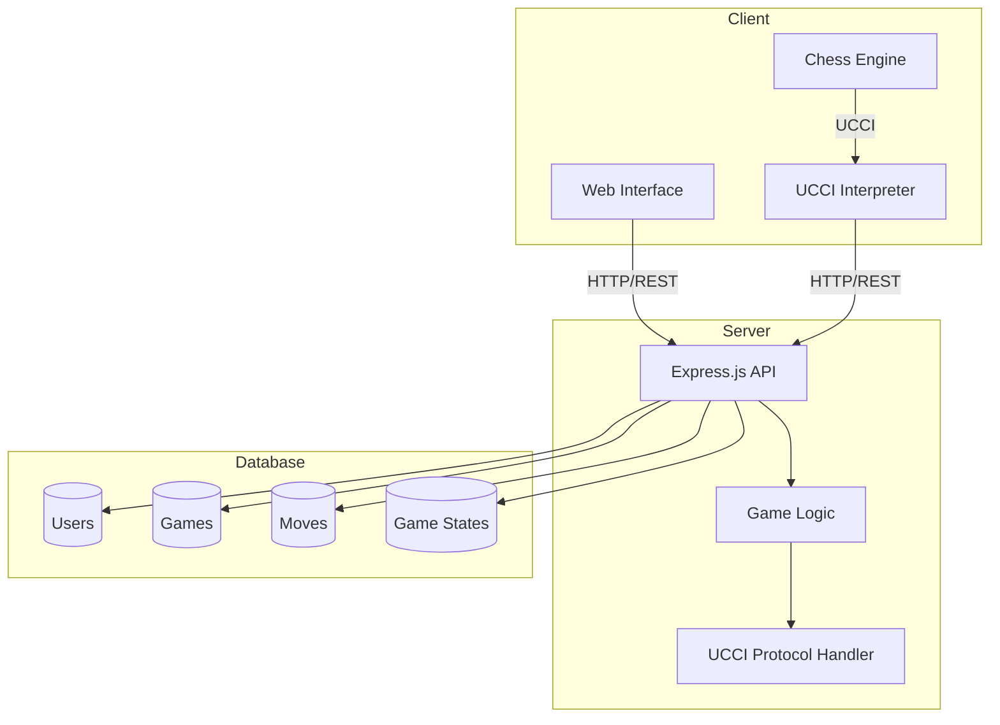

# Xiangqi Game Backend API

Express.js REST API server for Xiangqi (Chinese Chess) game platform.

## Architecture

## Tech Stack

- **Runtime**: Node.js
- **Framework**: Express.js
- **Database**: MongoDB
- **Authentication**: JWT

## Core Features

### Game Engine
- Game state management
- Move validation
- Check/checkmate detection
- Game history tracking

### Authentication
- User registration/login
- JWT authentication
- Profile management

### Game Management
- Create/join games
- Turn-based gameplay
- Move validation
- Game state persistence

## Related Repositories

This project is part of the Xiangqi (Chinese Chess) application:

- Frontend Repository: [xiangqi-frontend](https://github.com/hien-duc/xiangqi-frontend)
- Backend Repository: [xiangqi-backend](https://github.com/hien-duc/xiangqi-backend)

## Project Structure

- **Frontend**: Next.js application serving the user interface
- **Backend**: Express.js REST API handling game logic and data