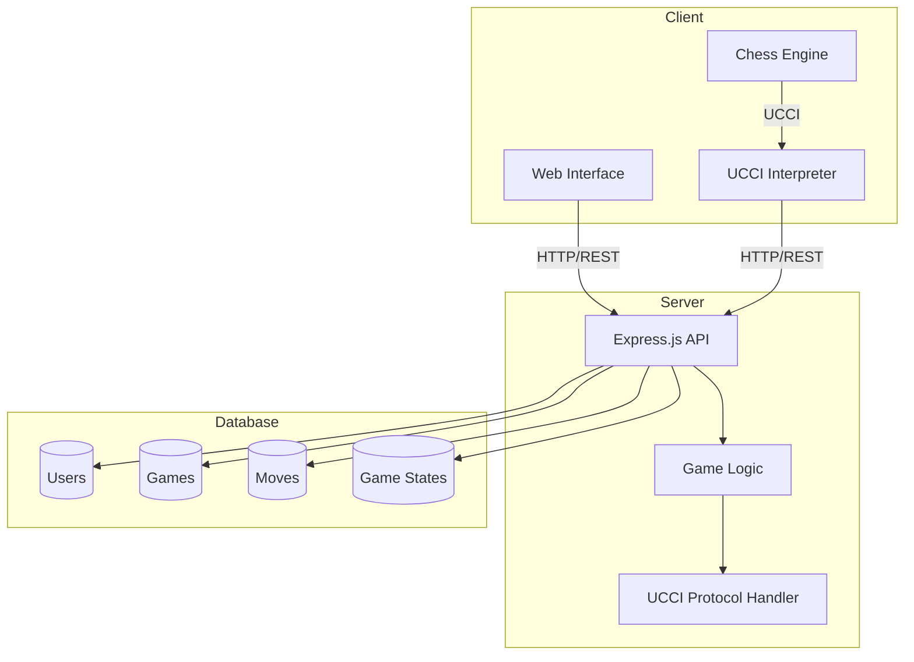

# Xiangqi Game Backend API

Express.js REST API server for Xiangqi (Chinese Chess) game platform.

## Architecture


### System Flow
1. **Express.js API (Server Entry Point)**
   - Handles HTTP requests from clients
   - Routes game operations and moves
   - Manages user sessions and authentication

2. **Game Logic**
   - Validates moves according to Xiangqi rules
   - Manages game states and turn flow
   - Coordinates with UCCI handler for AI moves

3. **UCCI Handler**
   - Translates game moves to UCCI protocol
   - Interfaces with Chinese Chess engines
   - Processes engine responses back to game format

4. **Database Layer**
   - Stores user information and game states
   - Tracks move history and game progression
   - Maintains player statistics and rankings

## Tech Stack

- **Runtime**: Node.js
- **Framework**: Express.js
- **Database**: MongoDB
- **Authentication**: JWT

## Core Features

### Game Engine
- Game state management
- Move validation
- Check/checkmate detection
- Game history tracking

### Authentication
- User registration/login
- JWT authentication
- Profile management

### Game Management
- Create/join games
- Spectator mode
- Turn-based gameplay
- Move validation
- Game state persistence
- Basic AI opponent for practice

## Key API Endpoints:

### Game Management
```
POST /api/games/create           // Create new game
POST /api/games/join/:gameId     // Join existing game
GET  /api/games/:gameId         // Get game state
POST /api/games/:gameId/move    // Make a move
```

### UCCI Integration
```
POST /api/ucci/position         // Send position to engine
POST /api/ucci/analyze         // Request position analysis
GET  /api/ucci/bestmove        // Get engine's best move
```

### User Management
```
POST /api/auth/register        // Register new user
POST /api/auth/login          // Login user
GET  /api/users/profile       // Get user profile
GET  /api/users/stats         // Get user statistics
```

## Related Repositories

This project is part of the Xiangqi (Chinese Chess) application:

- Frontend Repository: [xiangqi-frontend](https://github.com/hien-duc/xiangqi-frontend)
- Backend Repository: [xiangqi-backend](https://github.com/hien-duc/xiangqi-backend)

## Project Structure

- **Frontend**: Next.js application serving the user interface
- **Backend**: Express.js REST API handling game logic and data